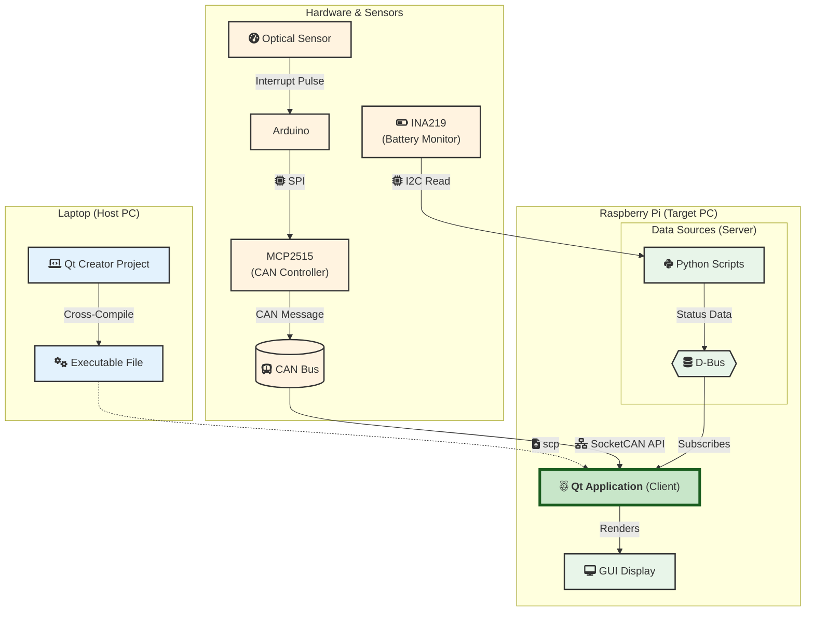

# PiRacer Digital Instrument Cluster

This is a real-time digital instrument cluster application for the PiRacer vehicle, developed with Qt. It runs on a Raspberry Pi, receiving vehicle speed data via CAN bus and other data like battery and gear status via D-Bus to display on a GUI.

<p align="center">

</p>

## Key Features

* **Real-time Data Visualization**: Displays vehicle speed from the CAN bus on a real-time speedometer.
* **Vehicle Status Display**: Shows battery state of charge (SOC), charging current, and current gear (`P`, `N`, `R`, `D`) received through D-Bus.
* **Modular IPC Architecture**: Employs a flexible and scalable structure by decoupling the data processing part (Python) from the GUI (Qt/C++) using D-Bus.
* **Qt/QML-based UI**: Provides a user-friendly graphical interface designed with Qt Design Studio.

## System Architecture & Design Decisions



### Data Flow

This project integrates two independent data streams:

1.  **Real-time Speed Data (Direct CAN Communication)**
    * **Measurement (Arduino)**: An optical speed sensor connected to an Arduino detects wheel rotation and sends speed data over the CAN bus.
    * **Reception & Processing (Qt/C++)**: A C++ CAN interface (`caninterface.cpp`) within the Qt application directly receives and processes the real-time speed data from the CAN bus.

2.  **Vehicle Status Data (D-Bus IPC)**
    * **Publishing (Python on RPi)**: Separate Python scripts (`vehicle_controller.py`, `soc.py`) act as D-Bus 'Senders', broadcasting information like battery and gear status.
    * **Subscribing (Qt/C++)**: The Qt application's D-Bus client (`dbusreceiver.cpp`) acts as a 'Receiver', subscribing to this status data and reflecting it on the GUI.

### Development Decisions

This project intentionally adopted specific development methodologies to deepen technical understanding.

* **Cross-Compilation Environment**: We adopted a professional embedded development workflow by cross-compiling on a powerful development PC and deploying only the executable to the resource-constrained Raspberry Pi. This significantly reduced build times and maximized productivity.
* **IPC using D-Bus**: We deliberately separated the data processing logic (Python) from the GUI (Qt/C++) and connected them via D-Bus. The goal was to experience a modular design where multiple, single-responsibility processes communicate, which greatly enhances the system's flexibility and scalability.

## Tech Stack

* **Hardware**:
    * **Main Controller**: Raspberry Pi 4
    * **Sensor Controller**: Arduino Uno
    * **CAN Interface**:
        * **Raspberry Pi**: Waveshare 2-Channel CAN FD HAT
        * **Arduino**: Seeed Studio CAN-BUS Shield V2.0
    * **Sensor**: Optical Speed Sensor (LM393)
* **Software**:
    * **Languages**: C++, Python, QML
    * **Frameworks / Libraries**: Qt 5, dbus-python, piracer, gamepads, PyGObject
    * **IPC (Inter-Process Communication)**: D-Bus
    * **Build System**: Qt-based Cross-Compilation (PC → Raspberry Pi)

## Implementation Details

### 1. Speed Measurement & CAN Transmission (Arduino)

* Pulses from the optical speed sensor are counted using an interrupt pin (`3`) on the Arduino.
* Inside the `loop()` function, the accumulated pulse count is used to calculate RPM and distance traveled every 100ms, which is then converted to speed in cm/s.
* The Seeed Studio CAN-BUS Shield, which uses **MCP2515** (CAN controller) and **MCP2551** (CAN transceiver) chips, encodes and transmits this speed data as a CAN message.

### 2. CAN Data Reception (Qt/C++)

* The `caninterface.cpp` module in the Qt application is dedicated to receiving CAN data.
* It uses Linux's SocketCAN interface to connect directly to the CAN bus, filtering and reading messages with the specific CAN ID for speed data.
* The received raw data is parsed into an actual speed value and then passed to the QML UI using Qt's Signal/Slot mechanism.

### 3. Status Data Publishing (Python)

* The `vehicle_controller.py` and `soc.py` scripts are responsible for vehicle control status (e.g., gear) and battery status (SOC), respectively.
* Using the `dbus-python` library, these scripts create unique services and object paths on D-Bus, emitting signals periodically or upon a state change.

### 4. D-Bus Data Subscription (Qt/C++)

* The `dbusreceiver.cpp` module uses Qt's `QtDBus` module to subscribe to the D-Bus signals emitted by the Python scripts.
* It connects by targeting specific service names, object paths, and interfaces. When a signal is received, the connected slot function is executed to update the relevant part of the QML UI.

## Setup and Execution

### 1. Hardware Connection

*(Link to detailed instructions to be added)*

### 2. Environment Setup

*(Link to detailed instructions to be added)*

### 3. Build and Run

1.  **Run Data Senders (on RPi)**: Open a terminal on the Raspberry Pi, activate the virtual environment, and run the Python scripts in the background.
    ```bash
    cd DES_Instrument-Cluster_team06/
    source venv/bin/activate
    cd app/src/sender
    python soc.py &
    python vehicle_controller.py &
    ```

2.  **Run GUI Application**:
    1.  **Cross-Compile (on PC)**: Build the project in Qt Creator on your PC to generate the executable for the Raspberry Pi.
    2.  **Transfer File (from PC)**: Use the `scp` command to transfer the generated executable to the Raspberry Pi.
        ```bash
        # Example: scp [path_to_executable] [pi_username]@[pi_ip_address]:~
        scp ./YourProjectName pi@192.168.1.10:~/
        ```
    3.  **Execute (on RPi)**: SSH into the Raspberry Pi, grant execute permissions, set the display environment variable, and run the application.
        ```bash
        ssh pi@192.168.1.10
        
        chmod +x ~/YourProjectName
        export DISPLAY=:0
        ./YourProjectName
        ```

## Contributors

* **JAEHONG LIM** - (System Architecture, Qt C++ Backend, Python/Arduino Development)
* **SIWOO LEE** - (Hardware Assembly, Qt GUI Development)
